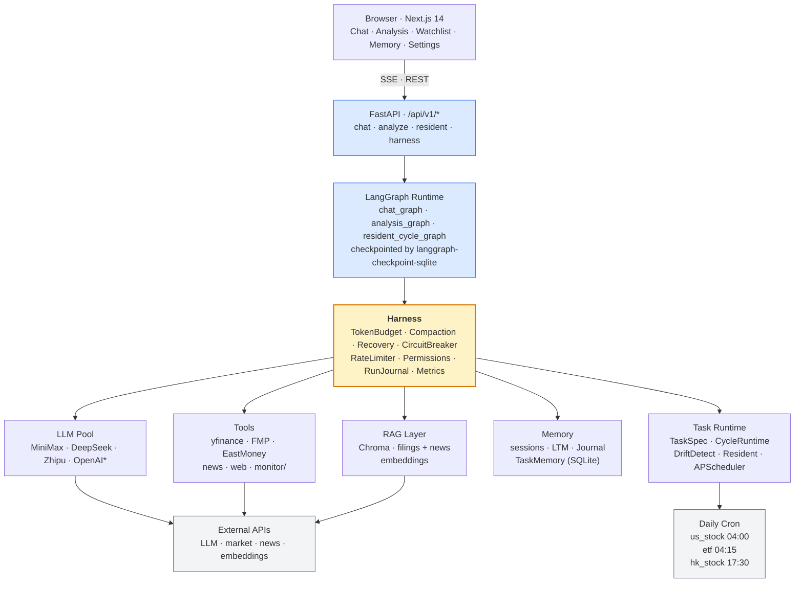
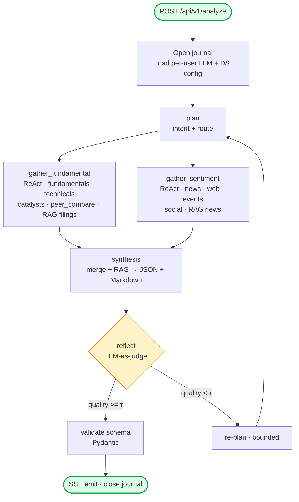
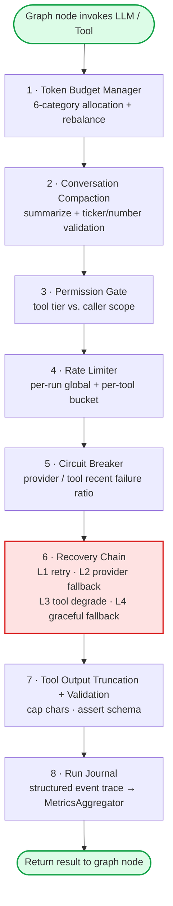
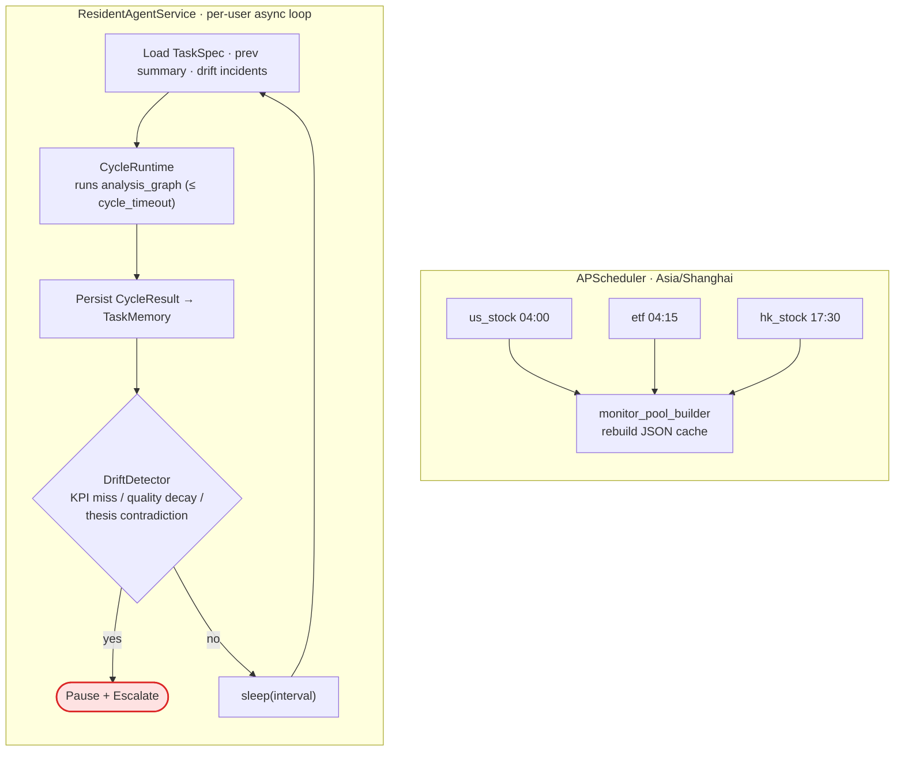

<div align="center">

# Atlas · StockClaw

**An autonomous research agent for equities — built on LangGraph, wrapped in a custom Harness layer.**

### 🚀 Try it now → **[stockclaw.me](http://39.108.61.53)**

*No signup. No local setup. Just open the link.*

[](http://39.108.61.53)

<sub>Domain pending ICP registration — link currently resolves to the origin server IP.</sub>

---

[](https://www.python.org/downloads/)
[](https://github.com/langchain-ai/langgraph)
[](https://nextjs.org/)
[](https://fastapi.tiangolo.com/)
[](LICENSE)
[]()

[**Architecture**](#architecture) · [**Quick Start**](#quick-start) · [**Harness Deep Dive**](#the-harness-layer)

**English** · [简体中文](README.zh-CN.md)

</div>

---

## Overview

**Atlas** is an end-to-end agent runtime for financial research. It pairs a LangGraph-based multi-agent workflow with a purpose-built *Harness* — an operating-system-like layer that sits between the graph and the LLM to manage context, recover from failures, audit decisions, and run long-lived tasks.

Where most LLM applications stop at *prompt + tool-calling*, Atlas treats the LLM as one unreliable component inside a larger system:

- The context window is a **finite resource** managed by a token-budget allocator, not a prompt string.
- Every failure path — provider outage, tool timeout, content filter, rate limit — is handled by a **four-level recovery chain**.
- Every run emits a **structured decision journal** that can be replayed, audited, and aggregated into quality metrics.
- Long-running research goals run as **autonomous cycles** with memory, drift detection, and KPI tracking across sessions.

The frontend is a Next.js workspace that exposes chat, single-stock analysis, watchlist, long-term memory, and a live resident-agent console.

---

## Table of Contents

- [Overview](#overview)
- [Key Features](#key-features)
- [Architecture](#architecture)
- [The Harness Layer](#the-harness-layer)
- [Tech Stack](#tech-stack)
- [Project Structure](#project-structure)
- [Quick Start](#quick-start)
- [Configuration](#configuration)
- [Usage](#usage)
- [Testing & Evaluation](#testing--evaluation)
- [Roadmap](#roadmap)
- [Acknowledgments](#acknowledgments)
- [License](#license)

---

## Key Features

### Agent & Workflow
- **Multi-agent orchestration** — specialised gather / synthesis / reflection / quality-check nodes composed via LangGraph.
- **Tool-calling with guardrails** — every tool is wrapped with truncation, permission tiers, and per-run rate limits.
- **Resident agent** — persistent per-user research loops with configurable cadence, KPI constraints, and drift detection.
- **Session & cross-session memory** — three memory layers: checkpointed session state, SQLite long-term memory, and Chroma vector store for RAG over filings and news.

### Harness Infrastructure
- **Token Budget Manager** — category-based allocation of the context window (system prompt / tool results / conversation / RAG / long-term memory / completion buffer), with automatic rebalancing and trimming.
- **Conversation Compaction** — LLM-based summarisation of older turns with ticker/number retention validation — compaction is rejected if critical entities are lost.
- **4-Level Recovery Chain** — retry → provider fallback → tool-level degradation → graceful final fallback.
- **Circuit Breakers** — per-provider and per-tool breakers with configurable thresholds and cooldowns.
- **Run Journal** — structured decision trace for every graph invocation (`node_start`, `tool_call`, `llm_call`, `error`, `recovery`, `node_end`).
- **Metrics Aggregator** — dashboards for P50/P95 latency, First-Completion-Rate, recovery hit rate, and auto-generated "resume bullets".

### Multi-provider & Multi-tenant
- **Pluggable LLM providers** — MiniMax, DeepSeek, Zhipu, OpenAI-compatible endpoints. Swap at runtime via per-user configuration.
- **Pluggable data sources** — Yahoo Finance (default), Financial Modeling Prep, Eastmoney (A-share), with a unified adapter layer and per-user priority rules.
- **Per-user isolation** — each user has their own LLM keys, datasource priorities, watchlist, long-term memories, and resident tasks.

### Frontend
- Chat workspace with streaming SSE.
- Single-stock analysis report with structured JSON + Markdown.
- Watchlist with long-term memory surface.
- Resident-agent control panel with cycle history and drift incidents.
- Settings for LLM / datasource / permissions.

---

## Architecture

Atlas has four conceptual layers — browser workspace, FastAPI entry surface, LangGraph runtime wrapped by the **Harness**, and pluggable services (LLMs, tools, RAG, memory, task runtime). The diagrams below zoom in from system topology down to a single LLM call.

### System Topology

<details>
<summary><b>📊 Rendered diagram (click to expand)</b></summary>



</details>

```
┌───────────────────────────────────────────────────────────────────────────┐
│                         Browser  ·  Next.js 14                            │
│   ┌──────┐ ┌──────────┐ ┌──────────┐ ┌────────┐ ┌──────────┐              │
│   │ Chat │ │ Analysis │ │Watchlist │ │ Memory │ │ Settings │              │
│   └──────┘ └──────────┘ └──────────┘ └────────┘ └──────────┘              │
└──────────────────────────────────┬────────────────────────────────────────┘
                                   │ SSE · REST · JSON
                                   ▼
┌───────────────────────────────────────────────────────────────────────────┐
│                         FastAPI  ·  /api/v1/*                             │
│                                                                           │
│   Entry points                                                            │
│     /chat        SSE streaming conversation                               │
│     /analyze     SSE single-ticker deep report                            │
│     /resident/*  start / stop / status per-user research loops            │
│     /harness/*   dashboard · breakers · pool-refresh                      │
│                                                                           │
│   ┌─────────────────── LangGraph Runtime ──────────────────────┐          │
│   │  chat_graph  ·  analysis_graph  ·  resident_cycle_graph    │          │
│   │  checkpointed by langgraph-checkpoint-sqlite               │          │
│   └──────────────────────────┬─────────────────────────────────┘          │
│                              │  every LLM / tool call                     │
│                              ▼                                            │
│   ┌───────────────────────── Harness ──────────────────────────┐          │
│   │  TokenBudget · Compaction(+validate) · Recovery(L1→L4)     │          │
│   │  CircuitBreaker · RateLimiter · Permissions                │          │
│   │  RunJournal · MetricsAggregator                            │          │
│   └──┬────────┬──────────────┬──────────────┬─────────┬────────┘          │
│      ▼        ▼              ▼              ▼         ▼                   │
│  ┌────────┐┌────────┐┌─────────────┐┌───────────┐┌─────────────┐          │
│  │ LLM    ││ Tools  ││  RAG Layer  ││  Memory   ││  Task       │          │
│  │ Pool   ││        ││             ││           ││  Runtime    │          │
│  │        ││yfinance││  Chroma     ││  sessions ││             │          │
│  │MiniMax ││FMP     ││ (filings +  ││  LTM      ││ TaskSpec    │          │
│  │DeepSeek││EastMny ││    news)    ││  Journal  ││ CycleRuntime│          │
│  │Zhipu   ││news/web││ Embeddings  ││ TaskMemory││ DriftDetect │          │
│  │OpenAI* ││monitor/││             ││  (SQLite) ││ Resident    │          │
│  │        ││        ││             ││           ││ APScheduler │          │
│  └────┬───┘└────┬───┘└──────┬──────┘└───────────┘└──────┬──────┘          │
└───────┼────────┼────────────┼──────────────────────────┼─────────────────┘
        ▼        ▼            ▼                          ▼
   ┌──────────────────────────────────────┐      ┌───────────────────┐
   │  External APIs                       │      │  Daily cron jobs  │
   │  LLM providers · market & news data  │      │   us_stock  04:00 │
   │  embedding providers                 │      │   etf       04:15 │
   └──────────────────────────────────────┘      │   hk_stock  17:30 │
                                                 └───────────────────┘
```

**Key isolation boundaries**
- Each per-user request carries its own LLM config, datasource priority, RAG collection, journal session, and long-term memory scope.
- The Harness is a **wrapper**, not a separate service — every node call inherits it automatically via callback decorators, so graph nodes never talk to providers directly.

---

### Analysis Graph

<details>
<summary><b>📊 Rendered diagram (click to expand)</b></summary>



</details>

```
        POST /api/v1/analyze  { user_id, ticker }
                     │
                     ▼
            ┌──────────────────┐
            │  open journal,   │
            │  load per-user   │
            │  LLM + DS config │
            └────────┬─────────┘
                     ▼
            ┌──────────────────┐
            │       plan       │
            │  intent + route  │
            └────────┬─────────┘
                     │
          ┌──────────┴──────────┐
          ▼                     ▼
 ┌──────────────────┐  ┌──────────────────┐
 │gather_fundamental│  │ gather_sentiment │
 │   ReAct agent    │  │    ReAct agent   │
 │                  │  │                  │
 │ tools:           │  │ tools:           │
 │  get_fundamental │  │  get_news        │
 │  get_technicals  │  │  web_search      │
 │  get_catalysts   │  │  event_analyzer  │
 │  peer_compare    │  │  social_signal   │
 │  RAG: filings    │  │  RAG: news       │
 └────────┬─────────┘  └─────────┬────────┘
          └──────────┬───────────┘
                     ▼
           ┌──────────────────┐
           │    synthesis     │
           │ merges both +    │
           │ RAG evidence →   │
           │ structured JSON  │
           │ + Markdown       │
           └─────────┬────────┘
                     ▼
           ┌──────────────────┐    quality<τ    ┌────────────┐
           │     reflect      ├────────────────▶│  re-plan   │
           │  (LLM-as-judge)  │                 │  (bounded) │
           └─────────┬────────┘                 └─────┬──────┘
                     │ pass                           │
                     │                                │
                     │   ◀────────────────────────────┘
                     ▼
           ┌──────────────────┐
           │ validate schema  │
           │   (Pydantic)     │
           └─────────┬────────┘
                     ▼
           ┌──────────────────┐
           │    emit (SSE)    │
           │   close journal  │
           └──────────────────┘
```

**Every node above is wrapped by the Harness** — token budget is reserved before the call, the LLM is retried / failed-over via Recovery L1-L4, tool output is truncated and permission-checked, and the Journal receives structured events the MetricsAggregator later summarises.

---

### Harness Stack · One LLM or Tool Call

<details>
<summary><b>📊 Rendered diagram (click to expand)</b></summary>



</details>

```
┌───────────────────────────────────────────────────────────────┐
│            Graph node invokes LLM / Tool                      │
└────────────────────────────┬──────────────────────────────────┘
                             ▼
┌───────────────────────────────────────────────────────────────┐
│ 1. Token Budget Manager                                       │
│    Room in {system · ltm · tool · conv · rag · buffer}?       │
│    If not → rebalance from surplus categories                 │
├───────────────────────────────────────────────────────────────┤
│ 2. Conversation Compaction                                    │
│    Usage > threshold → summarize older turns; validate        │
│    ticker / number retention; rollback if critical            │
│    entities lost                                              │
├───────────────────────────────────────────────────────────────┤
│ 3. Permission Gate                                            │
│    Tool tier (read / write / external) vs. caller scope       │
├───────────────────────────────────────────────────────────────┤
│ 4. Rate Limiter                                               │
│    Per-run global budget + per-tool bucket                    │
├───────────────────────────────────────────────────────────────┤
│ 5. Circuit Breaker                                            │
│    Provider / tool recent failure ratio.  If OPEN →           │
│    fail fast → jump to Recovery directly                      │
├───────────────────────────────────────────────────────────────┤
│ 6. Recovery Chain                                             │
│    L1  retry (exponential backoff)                            │
│    L2  provider fallback  (MiniMax → DeepSeek → Zhipu)        │
│    L3  tool-level degradation  (summary / cached)             │
│    L4  graceful structured fallback                           │
├───────────────────────────────────────────────────────────────┤
│ 7. Tool Output Truncation + Validation                        │
│    Cap characters, assert schema, drop malformed rows         │
├───────────────────────────────────────────────────────────────┤
│ 8. Run Journal                                                │
│    Structured event per attempt (start / call / error /       │
│    recovery / end) — consumed by MetricsAggregator            │
└────────────────────────────┬──────────────────────────────────┘
                             ▼
                 Return result to graph node
```

The point of the stack: **no node ever has to care about which provider is up, how big the context is, or whether to retry.** Those concerns are handled uniformly so graph logic stays focused on workflow.

---

### Resident Agent Loop & Daily Pool Refresh

<details>
<summary><b>📊 Rendered diagram (click to expand)</b></summary>



</details>

```
  APScheduler · Asia/Shanghai                ResidentAgentService
  (daily pool refresh)                       (per-user async loop)
           │                                         │
  cron    us_stock  04:00                    interval from
           etf       04:15                   ResidentAgentRecord
           hk_stock  17:30                           │
           │                                         ▼
           ▼                              ┌──────────────────────┐
 ┌────────────────────┐                   │ load TaskSpec        │
 │ monitor_pool_      │                   │ load prev summary    │
 │ builder            │                   │ load drift incidents │
 │ rebuild JSON cache │                   └──────────┬───────────┘
 └────────────────────┘                              ▼
                                          ┌──────────────────────┐
                                          │    CycleRuntime       │
                                          │  runs analysis_graph │
                                          │  ≤ cycle_timeout     │
                                          └──────────┬───────────┘
                                                     ▼
                                          ┌──────────────────────┐
                                          │ persist CycleResult  │
                                          │ → TaskMemory         │
                                          └──────────┬───────────┘
                                                     ▼
                                          ┌──────────────────────┐
                                          │   DriftDetector      │
                                          │ KPI miss streak /    │
                                          │ quality decay /      │
                                          │ thesis contradiction │
                                          └──────────┬───────────┘
                                                     ▼
                                             drift? ── yes ──▶ pause + escalate
                                                     │
                                                     no
                                                     ▼
                                              sleep(interval)
                                                     │
                                                     └──▶ loop
```

The resident loop is what makes Atlas *autonomous* rather than *reactive* — once a user defines a TaskSpec, cycles keep running with memory, drift checks, and KPI tracking, even when nobody is looking.

---

## The Harness Layer

The Harness is the heart of the project and the part worth reading. It is a set of thin, composable utilities that wrap the LLM so the graph stays focused on *workflow* and never has to worry about *reliability*.

### Token Budget Manager
The context window is divided into six categories — `system_prompt`, `long_term_memory`, `tool_results`, `conversation`, `rag_context`, `completion_buffer` — each with its own allocation (default `5% / 8% / 30% / 32% / 15% / 10%`). Nodes `record()` their usage per category and can query `remaining()` before adding more. Unused categories donate surplus to overflowing ones via `rebalance()`.

### Conversation Compaction
When total usage crosses a configurable threshold (default `0.85`), older messages are summarised via an LLM call and replaced with a single system message. **Critical**: the summary is validated — if too many tickers or significant numbers are lost, the compaction is rejected and originals are retained. This prevents silent data corruption from overzealous summarisation.

### Multi-Level Recovery
A `RecoveryChain` wraps every LLM/tool invocation:

- **L1 · Retry** — with exponential backoff on transient errors.
- **L2 · Provider Fallback** — swap MiniMax → DeepSeek → Zhipu based on the provider health tracker.
- **L3 · Tool Degradation** — return a reduced response (e.g. summary only, or cached last-good value).
- **L4 · Graceful Fallback** — emit a structured "analysis incomplete" response with the raw data collected so far, so the user still gets value.

### Run Journal & Metrics
Every node emits structured events to a SQLite journal. The `MetricsAggregator` reads the journal to produce dashboards (`GET /harness/dashboard`): P50/P95 latency, per-tool success rates, recovery hit-rates, and a `resume_bullets` array suitable for performance reports.

### Task Lifecycle & Resident Agent
A **TaskSpec** encodes a long-running research goal (e.g. weekly earnings tracking). The **CycleRuntime** executes one cycle, persists results to **TaskMemory**, checks for **drift** against prior conclusions, and returns a structured cycle summary. The **ResidentAgentService** drives cycles on a user-configurable cadence with per-run rate limiting.

---

## Tech Stack

### Backend
- **Python 3.12**
- **LangChain / LangGraph** — agent orchestration
- **FastAPI** + **uvicorn** — HTTP / SSE server
- **Pydantic v2** — config & data models
- **SQLite** — session checkpoint, journal, long-term memory, task memory
- **Chroma** — vector store for RAG
- **yfinance / FMP / Eastmoney** — financial data adapters

### Frontend
- **Next.js 14** (App Router)
- **React 18** + **TypeScript 5**
- **Tailwind CSS 3** + **tailwindcss-animate**
- **framer-motion**, **lucide-react**, **react-markdown**

### Dev & Quality
- **pytest** (async) + **pytest-httpx**
- **LLM-as-judge** evaluation harness (`eval/`)
- **ruff** + **mypy**

---

## Project Structure

```text
.
├── frontend/                 # Next.js application
│   ├── app/                  # routes: chat, analysis, watchlist, memory, settings
│   ├── components/           # UI components
│   └── lib/                  # API client & shared types
│
├── langchain_agent/          # FastAPI + LangGraph backend
│   ├── app/
│   │   ├── agents/           # graph nodes (gather, synthesis, reflect, ...)
│   │   ├── api/              # FastAPI routes
│   │   ├── harness/          # ← the harness layer (see below)
│   │   ├── llm/              # provider factory
│   │   ├── memory/           # checkpointer, vector store, RAG evidence
│   │   ├── tools/            # truncated / guarded tool wrappers
│   │   ├── providers/        # financial data adapters
│   │   ├── prompts/          # prompt templates
│   │   ├── models/           # pydantic schemas
│   │   └── main.py           # app entrypoint
│   ├── tests/                # unit & integration tests
│   ├── eval/                 # LLM-judge & report-structure evals
│   └── pyproject.toml
│
└── monitor/                  # market pool / universe builders
    └── …
```

**Harness modules** (`langchain_agent/app/harness/`):

```
context.py            token budget manager
compaction.py         conversation compaction + validation
tool_output.py        tool result truncation & validation
recovery.py           4-level recovery chain
circuit_breaker.py    per-provider / per-tool circuit breakers
rate_limiter.py       per-run global tool rate limiter
permissions.py        tool permission tiers
long_term_memory.py   cross-session SQLite memory
run_journal.py        structured decision trace
metrics.py            aggregator + dashboards
task_spec.py          task contract definitions
task_memory.py        cycle / KPI / drift persistence
cycle_runtime.py      autonomous cycle executor
drift_detector.py     goal-deviation detection
scheduler.py          recurring task scheduler
resident_agent.py     per-user resident loop
llm_config.py         per-user LLM provider config
datasource_config.py  per-user data-source priority
user_store.py         lightweight user persistence
```

---

## Quick Start

### Prerequisites
- Python 3.12+
- Node.js 20+
- An API key from at least one supported LLM provider

### 1. Clone & install

```bash
git clone https://github.com/DorianYoung7702/StockClaw.git
cd StockClaw

# Backend
cd langchain_agent
python -m venv .venv
source .venv/bin/activate           # Windows: .venv\Scripts\activate
pip install -e .

# Frontend
cd ../frontend
npm install
```

### 2. Configure

Copy the template and fill in at least one provider key:

```bash
cp langchain_agent/env.template langchain_agent/.env
```

Minimum `.env`:

```env
LLM_PROVIDER=minimax
MINIMAX_API_KEY=sk-...
```

See [Configuration](#configuration) for the full list.

### 3. Run

```bash
# Terminal 1 — backend
cd langchain_agent
uvicorn app.main:app --reload --port 8000

# Terminal 2 — frontend
cd frontend
npm run dev
```

Open http://localhost:3000.

---

## Configuration

All configuration is via environment variables, loaded by `pydantic-settings` from `langchain_agent/.env`.

### LLM Providers

| Variable | Description | Default |
|----------|-------------|---------|
| `LLM_PROVIDER` | `minimax` · `deepseek` · `zhipu` · `openai_compatible` | `minimax` |
| `MINIMAX_API_KEY` | MiniMax API key | — |
| `DEEPSEEK_API_KEY` | DeepSeek API key | — |
| `ZHIPU_API_KEY` | Zhipu GLM API key | — |
| `OPENAI_API_KEY` | OpenAI-compatible key | — |
| `OPENAI_BASE_URL` | OpenAI-compatible base URL | — |
| `TOOL_CALLING_MODEL` | Model name for tool calls | provider default |
| `REASONING_MODEL` | Model name for synthesis | provider default |

### Harness

| Variable | Description | Default |
|----------|-------------|---------|
| `HARNESS_MODEL_CONTEXT_LIMIT` | Total context window (tokens) | `128000` |
| `HARNESS_COMPACTION_THRESHOLD` | Usage ratio that triggers compaction | `0.85` |
| `HARNESS_COMPACTION_KEEP_RECENT` | Recent messages kept verbatim | `6` |
| `HARNESS_TOOL_OUTPUT_MAX_CHARS` | Max characters per tool result | `4000` |
| `HARNESS_CIRCUIT_BREAKER_THRESHOLD` | Consecutive failures before open | `3` |
| `HARNESS_CIRCUIT_BREAKER_COOLDOWN` | Seconds to stay open | `60` |
| `HARNESS_RECOVERY_MAX_RETRY` | Level-1 retry attempts | `3` |
| `RESIDENT_DEFAULT_INTERVAL_SECONDS` | Resident-agent cycle cadence | `300` |

### Data Sources

| Variable | Description |
|----------|-------------|
| `FINANCIAL_DATA_PROVIDER` | `eastmoney` (default) or `fmp` |
| `FMP_API_KEY` | Financial Modeling Prep key |
| `FUNDAMENTAL_RAG_ENABLED` | Enable filing/news vector RAG |
| `EMBEDDING_API_KEY` | Embedding provider key (for Chroma) |
| `EMBEDDING_BASE_URL` | Embedding provider base URL |

---

## Usage

### Chat with streaming SSE

```bash
curl -N -X POST http://localhost:8000/api/chat \
  -H 'Content-Type: application/json' \
  -d '{"user_id": "demo", "message": "Give me a read on NVDA this week"}'
```

### Deep analysis

```bash
curl -X POST http://localhost:8000/api/analyze \
  -H 'Content-Type: application/json' \
  -d '{"user_id": "demo", "ticker": "NVDA"}'
```

Returns a structured intelligence briefing plus a Markdown report.

### Resident agent

```bash
# Start a resident research loop for the user's watchlist
curl -X POST http://localhost:8000/api/resident/start \
  -d '{"user_id": "demo", "interval_seconds": 300}'

# Inspect cycle history & drift incidents
curl http://localhost:8000/api/resident/status?user_id=demo
```

### Harness dashboard

```bash
curl http://localhost:8000/harness/dashboard
```

Returns latency percentiles, recovery hit rate, and auto-generated metric bullets.

---

## Testing & Evaluation

```bash
cd langchain_agent

# Unit & integration tests
pytest

# Evaluation harness (LLM-as-judge, intent accuracy, report structure)
pytest eval/
```

Key test suites:

- `tests/test_phase1.py` — harness core (budget, compaction, tool output).
- `tests/test_recovery_chain.py` — 4-level recovery paths.
- `tests/test_compaction_validation.py` — ticker/number retention.
- `tests/test_rate_limiter.py` — per-run rate limits.
- `tests/test_rag.py` — vector store & evidence retrieval.
- `eval/test_llm_judge.py` — LLM-as-judge scoring of reports.
- `eval/test_report_structure.py` — schema-level report validation.

---

## Roadmap

- [x] Phase 1 — Context Engineering (budget, compaction, tool output)
- [x] Phase 2 — Error Recovery (4-level chain, breakers)
- [x] Phase 3 — Tool Guardrails (permissions, rate limits)
- [x] Phase 4 — User Persistence (LLM + datasource config per user)
- [x] Phase 5 — Run Journal & Metrics
- [x] Phase 6 — Task Lifecycle (TaskSpec, CycleRuntime, TaskMemory)
- [x] Phase 7 — Resident Agent + Drift Detection
- [x] Phase 8 — APScheduler-driven daily pool refresh
- [ ] Phase 9 — Multi-user auth + quota accounting
- [ ] Phase 10 — Portfolio-level cross-ticker reasoning

---

## Acknowledgments

Atlas stands on the shoulders of excellent open-source work:

- [LangChain](https://github.com/langchain-ai/langchain) · [LangGraph](https://github.com/langchain-ai/langgraph) — agent & graph runtime
- [FastAPI](https://fastapi.tiangolo.com/) — async web framework
- [Chroma](https://www.trychroma.com/) — embedded vector store
- [Next.js](https://nextjs.org/) + [Tailwind](https://tailwindcss.com/) — frontend stack
- [yfinance](https://github.com/ranaroussi/yfinance) — market data
- [MiniMax](https://www.minimaxi.com/) · [DeepSeek](https://www.deepseek.com/) · [Zhipu GLM](https://www.zhipuai.cn/) — LLM providers

---

## License

Released under the [Apache License 2.0](LICENSE).  
Copyright © 2026 DorianYoung7702. See [`NOTICE`](NOTICE) for third-party attributions.

---

<div align="center">

**Built with care for agent engineering.**  
[stockclaw.me](http://39.108.61.53) · [Report an issue](https://github.com/DorianYoung7702/StockClaw/issues)

</div>
