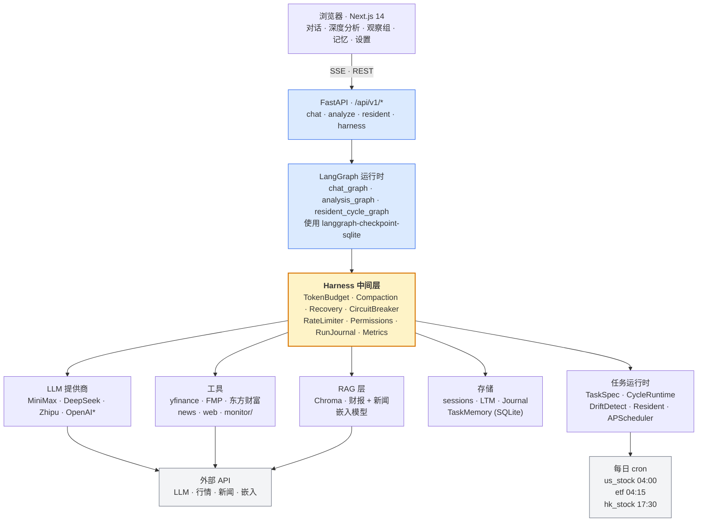
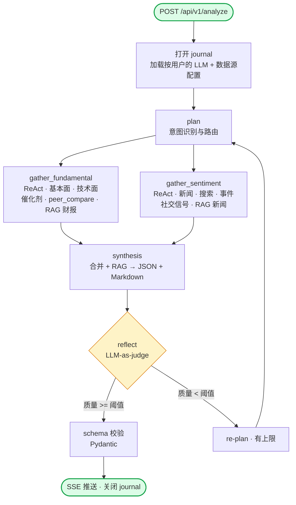
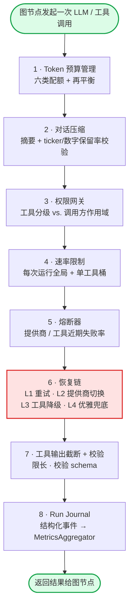
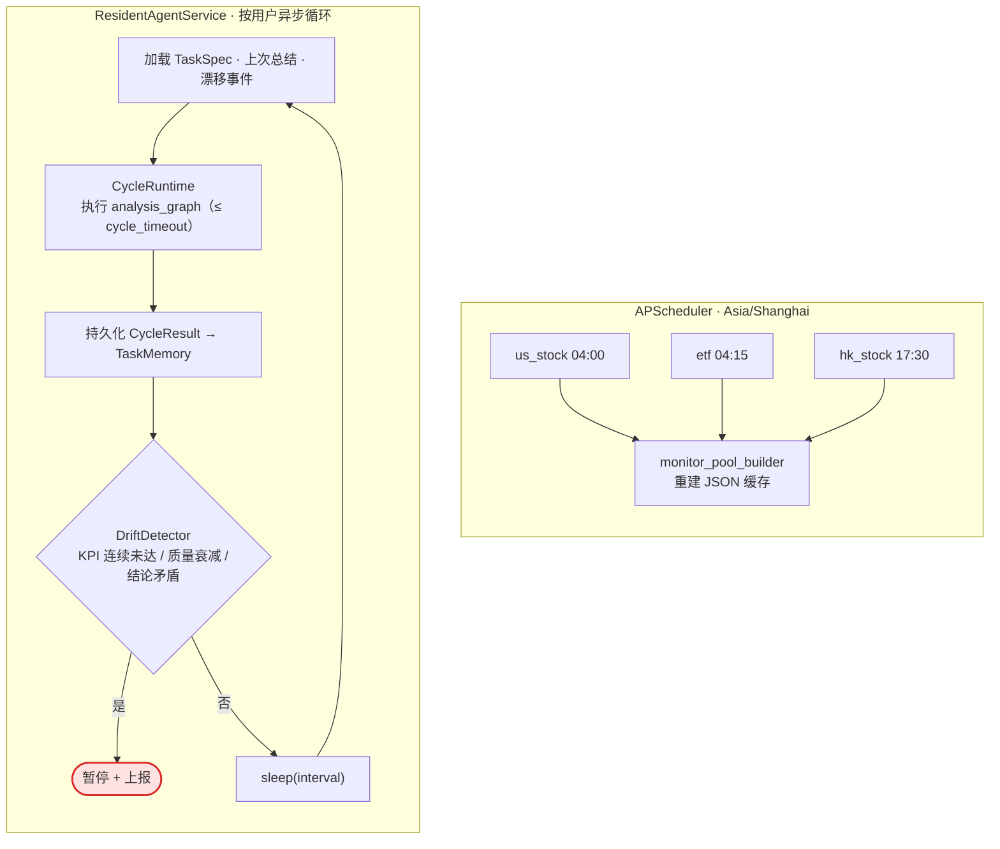

<div align="center">

#  StockClaw：Atlas

**一套自治的股票研究 Agent 平台。LangGraph 做编排，自研 Harness 做工程托底。**

### 🚀 立即体验 → **[stockclaw.me](http://39.108.61.53)**

*无需注册，无需本地部署，点击链接即可使用。*

[](http://39.108.61.53)

<sub>域名备案中，链接暂时直接指向服务器 IP。</sub>

---

[](https://www.python.org/downloads/)
[](https://github.com/langchain-ai/langgraph)
[](https://nextjs.org/)
[](https://fastapi.tiangolo.com/)
[](LICENSE)
[]()

[**架构**](#架构) · [**快速开始**](#快速开始) · [**Harness 解析**](#harness-层)

[English](README.md) · **简体中文**

</div>

---

## 项目简介

**StockClaw（内部代号 Atlas）** 是一套自治的股票研究 Agent 系统。它由两部分拼合而成：

- **LangGraph 图运行时** —— 负责多 Agent 的编排，把 plan / gather / synthesis / reflect 这些节点串成一个有状态的工作流。
- **Harness 工程中间层** —— 夹在图节点和 LLM 之间，统一处理上下文预算、错误恢复、决策审计、常驻任务调度这些"不是业务逻辑但出事就炸"的问题。

大多数 LLM 产品止步于"写好 Prompt，挂上几个工具"。StockClaw 的出发点不同：**LLM 本身是整个系统里最不稳定的一环**，必须当作会崩、会超时、会被限速的外部组件来对待。这套项目的工程重点也因此落在：

- 把上下文窗口当作**有限内存**来管理，按类别分配预算，而不是靠 prompt 字符串硬拼。
- 任何一次调用都可能失败（模型挂了、内容审查拦截、API 超时、限速），统一交给**四级恢复链**处理，节点本身不关心。
- 每次运行都落一份**结构化决策日志**，既可回放调试，也能自动聚合成 P50/P95、首次完成率、恢复命中率这些指标。
- 长期研究目标以**常驻 Agent + 周期巡检**的形式自治运行，跨会话记得上一轮结论，一旦发现目标漂移就自动暂停并上报。

前端是一个 Next.js 工作台，覆盖对话、单票深度分析、观察组、长期记忆、常驻 Agent 控制台、用户设置这六大场景。

---

## 目录

- [项目简介](#项目简介)
- [核心特性](#核心特性)
- [架构](#架构)
- [Harness 层](#harness-层)
- [技术栈](#技术栈)
- [仓库结构](#仓库结构)
- [快速开始](#快速开始)
- [配置](#配置)
- [使用示例](#使用示例)
- [测试与评估](#测试与评估)
- [路线图](#路线图)
- [致谢](#致谢)
- [许可证](#许可证)

---

## 核心特性

### Agent 与工作流
- **多 Agent 编排**：plan 负责意图识别和路由，gather_fundamental / gather_sentiment 作为 ReAct 子 Agent 并行采集基本面与舆情，synthesis 做合成，reflect 做 LLM-as-judge 质量打分，整体由 LangGraph 串起来。
- **工具带约束**：每个工具都走一层包装，输出会被截断、按 read / write / external 分级鉴权、按每次运行的全局配额限速。
- **常驻 Agent**：每个用户可以挂一个后台研究循环，周期、KPI 阈值、漂移检测策略都可配置，不在线也能跑。
- **三层记忆体系**：LangGraph checkpoint 负责单会话状态；SQLite 长期记忆持久化跨会话的关键结论；Chroma 向量库负责财报和新闻事件的 RAG 检索。

### Harness 工程中间层
- **Token 预算管理**：把上下文窗口切成 system / 长期记忆 / 工具输出 / 对话 / RAG / 输出 buffer 六类，每类独立配额，用不完的类别会自动把余量让给溢出的类别。
- **对话压缩 + 校验**：超过阈值就用 LLM 对旧消息做摘要替换。关键点是**摘要要过校验** —— ticker 和关键数字保留率不够就拒绝本次压缩，保留原文，避免摘要幻觉吃掉要命的数据。
- **四级恢复链**：L1 指数退避重试 → L2 按提供商健康度切换（MiniMax / DeepSeek / Zhipu）→ L3 工具级降级（走缓存或摘要）→ L4 最终优雅兜底（至少返回已采集的原始数据）。
- **熔断器**：为每个提供商和工具维护独立熔断器，连续失败到阈值就 OPEN，冷却后再试，避免把雪崩放大。
- **决策日志 Run Journal**：每个节点调用都落结构化事件（start / tool_call / llm_call / error / recovery / end），可回放，可审计。
- **指标聚合**：从 Journal 聚合出 P50/P95 延迟、首次完成率、每工具成功率、恢复命中率；顺便还会生成一组 resume bullets，可以直接贴绩效报告。

### 多模型与多数据源
- **LLM 可插拔**：MiniMax、DeepSeek、智谱 GLM、OpenAI 兼容端点全部走统一工厂，运行时按用户配置切换。
- **数据源可插拔**：Yahoo Finance（默认）、Financial Modeling Prep、东方财富（A 股）共用一个适配层，每个用户可以配自己的优先级。
- **按用户隔离**：每个用户的 LLM key、数据源优先级、观察组、长期记忆、常驻任务彼此完全隔离，不会串。

### 前端工作台
- 对话页：SSE 流式对话，可直接触发强势股扫描、单票深度分析、舆情摘要。
- 分析页：结构化 JSON 简报 + Markdown 报告双通道输出。
- 观察组：和长期记忆打通，可对单票添加研究笔记。
- 常驻 Agent 控制台：查看周期历史、漂移事件、KPI 达成情况。
- 设置页：统一管理 LLM 模型、数据源优先级、权限、Token。

---

## 架构

整个系统在逻辑上分四层：**浏览器工作台** → **FastAPI 入口** → **LangGraph 图运行时（被 Harness 包着）** → **可插拔服务栈（LLM / 工具 / RAG / 存储 / 任务运行时）**。下面四张图按"系统 → 流程 → 单次调用 → 常驻循环"的顺序逐层放大。

### 系统总览

<details>
<summary><b>📊 可视化渲染（点击展开）</b></summary>



</details>

```
┌───────────────────────────────────────────────────────────────────────────┐
│                         浏览器 · Next.js 14                               │
│   ┌──────┐ ┌──────────┐ ┌──────────┐ ┌────────┐ ┌──────────┐              │
│   │ 对话 │ │ 深度分析 │ │ 观察组   │ │ 记忆   │ │ 设置     │              │
│   └──────┘ └──────────┘ └──────────┘ └────────┘ └──────────┘              │
└──────────────────────────────────┬────────────────────────────────────────┘
                                   │ SSE · REST · JSON
                                   ▼
┌───────────────────────────────────────────────────────────────────────────┐
│                         FastAPI  ·  /api/v1/*                             │
│                                                                           │
│   入口点                                                                  │
│     /chat        SSE 流式对话                                             │
│     /analyze     SSE 单票深度分析                                         │
│     /resident/*  启停 / 查询用户常驻研究循环                              │
│     /harness/*   dashboard · breakers · pool-refresh                      │
│                                                                           │
│   ┌─────────────────── LangGraph 运行时 ──────────────────────┐           │
│   │  chat_graph  ·  analysis_graph  ·  resident_cycle_graph    │          │
│   │  使用 langgraph-checkpoint-sqlite 做 checkpoint            │          │
│   └──────────────────────────┬─────────────────────────────────┘          │
│                              │  每次 LLM / 工具调用                       │
│                              ▼                                            │
│   ┌─────────────────────── Harness 中间层 ─────────────────────┐          │
│   │  TokenBudget · Compaction(含校验) · Recovery(L1→L4)        │          │
│   │  CircuitBreaker · RateLimiter · Permissions                │          │
│   │  RunJournal · MetricsAggregator                            │          │
│   └──┬────────┬──────────────┬──────────────┬─────────┬────────┘          │
│      ▼        ▼              ▼              ▼         ▼                   │
│  ┌────────┐┌────────┐┌─────────────┐┌───────────┐┌─────────────┐          │
│  │ LLM    ││ 工具   ││  RAG 层     ││  存储     ││  任务运行时 │          │
│  │ 提供商 ││        ││             ││           ││             │          │
│  │        ││yfinance││  Chroma     ││  sessions ││ TaskSpec    │          │
│  │MiniMax ││FMP     ││ (财报 +     ││  LTM      ││ CycleRuntime│          │
│  │DeepSeek││东方财富││    新闻)    ││  Journal  ││ DriftDetect │          │
│  │Zhipu   ││news/web││ Embeddings  ││ TaskMemory││ Resident    │          │
│  │OpenAI* ││monitor/││             ││  (SQLite) ││ APScheduler │          │
│  └────┬───┘└────┬───┘└──────┬──────┘└───────────┘└──────┬──────┘          │
└───────┼────────┼────────────┼──────────────────────────┼─────────────────┘
        ▼        ▼            ▼                          ▼
   ┌──────────────────────────────────────┐      ┌───────────────────┐
   │  外部 API                            │      │  每日 cron 任务   │
   │  LLM 提供商 · 行情 / 新闻 / 嵌入模型 │      │   us_stock  04:00 │
   └──────────────────────────────────────┘      │   etf       04:15 │
                                                 │   hk_stock  17:30 │
                                                 └───────────────────┘
```

**两个关键设计决定**：
- **按用户隔离**：每次请求都带着自己的 LLM 配置、数据源优先级、RAG 集合、Journal 会话、长期记忆作用域，彼此不会串数据。
- **Harness 是包装器，不是独立服务**：通过 callback 装饰器让每个图节点调用时自动继承这层能力。节点代码里不会直接调 LLM SDK，这样"换提供商、改重试策略、加限速"这类改动都在 Harness 里改一处就够。

---

### 深度分析图

<details>
<summary><b>📊 可视化渲染（点击展开）</b></summary>



</details>

```
        POST /api/v1/analyze  { user_id, ticker }
                     │
                     ▼
            ┌──────────────────┐
            │ 打开 journal，   │
            │ 加载按用户的     │
            │ LLM + 数据源配置 │
            └────────┬─────────┘
                     ▼
            ┌──────────────────┐
            │       plan       │
            │   意图识别与路由 │
            └────────┬─────────┘
                     │
          ┌──────────┴──────────┐
          ▼                     ▼
 ┌──────────────────┐  ┌──────────────────┐
 │gather_fundamental│  │ gather_sentiment │
 │   ReAct 子 Agent │  │   ReAct 子 Agent │
 │                  │  │                  │
 │ 工具:            │  │ 工具:            │
 │  get_fundamental │  │  get_news        │
 │  get_technicals  │  │  web_search      │
 │  get_catalysts   │  │  event_analyzer  │
 │  peer_compare    │  │  social_signal   │
 │  RAG: 财报       │  │  RAG: 新闻事件   │
 └────────┬─────────┘  └─────────┬────────┘
          └──────────┬───────────┘
                     ▼
           ┌──────────────────┐
           │    synthesis     │
           │ 合并双路数据 +   │
           │ RAG 证据 →       │
           │ 结构化 JSON +    │
           │ Markdown 报告    │
           └─────────┬────────┘
                     ▼
           ┌──────────────────┐  质量 < 阈值 ┌────────────┐
           │     reflect      ├──────────────▶│  重规划    │
           │  (LLM-as-judge)  │              │  (有上限)  │
           └─────────┬────────┘              └─────┬──────┘
                     │ 通过                        │
                     │                             │
                     │   ◀─────────────────────────┘
                     ▼
           ┌──────────────────┐
           │  schema 校验     │
           │   (Pydantic)     │
           └─────────┬────────┘
                     ▼
           ┌──────────────────┐
           │  SSE 推送结果    │
           │  关闭 journal    │
           └──────────────────┘
```

**上图每个节点都被 Harness 包住**。调用前会预留 token 预算，LLM 调用走 Recovery L1-L4 的重试 / 切换路径，工具输出会被截断并做权限校验，每一步都向 Journal 写一条结构化事件，最后由 MetricsAggregator 聚合出指标。节点代码本身只关心"我要干什么"，不需要关心"怎么防止出错"。

---

### Harness 单次调用栈

<details>
<summary><b>📊 可视化渲染（点击展开）</b></summary>



</details>

```
┌───────────────────────────────────────────────────────────────┐
│         图节点发起一次 LLM / 工具调用                         │
└────────────────────────────┬──────────────────────────────────┘
                             ▼
┌───────────────────────────────────────────────────────────────┐
│ 1. Token 预算管理                                             │
│    六类（system · ltm · tool · conv · rag · buffer）           │
│    有余量吗？不够 → 从盈余类别再平衡                          │
├───────────────────────────────────────────────────────────────┤
│ 2. 对话压缩                                                   │
│    使用率 > 阈值 → LLM 摘要老消息；校验 ticker / 关键数字     │
│    保留率，不达标则回滚、保留原文                             │
├───────────────────────────────────────────────────────────────┤
│ 3. 权限网关                                                   │
│    工具分级（read / write / external）与调用方作用域比对      │
├───────────────────────────────────────────────────────────────┤
│ 4. 速率限制                                                   │
│    每次运行全局预算 + 单工具桶                                │
├───────────────────────────────────────────────────────────────┤
│ 5. 熔断器                                                     │
│    提供商 / 工具近期失败率。OPEN 状态 →                       │
│    快速失败，直接跳到 Recovery                                │
├───────────────────────────────────────────────────────────────┤
│ 6. 恢复链                                                     │
│    L1  重试（指数退避）                                       │
│    L2  提供商切换（MiniMax → DeepSeek → Zhipu）               │
│    L3  工具级降级（摘要 / 缓存）                              │
│    L4  优雅结构化兜底                                         │
├───────────────────────────────────────────────────────────────┤
│ 7. 工具输出截断与校验                                         │
│    限长、校验 schema、丢弃坏行                                │
├───────────────────────────────────────────────────────────────┤
│ 8. Run Journal                                                │
│    每次尝试写一条结构化事件（start / call / error /           │
│    recovery / end）—— 被 MetricsAggregator 消费               │
└────────────────────────────┬──────────────────────────────────┘
                             ▼
                 返回结果给图节点
```

Harness 的价值就在这里：**图节点不需要关心哪个提供商挂了、上下文还剩多少空间、要不要重试、要不要熔断**。这些统一由 Harness 吸收，图代码只专注工作流本身。改一处，全局生效。

---

### 常驻 Agent 循环 与 每日池刷新

<details>
<summary><b>📊 可视化渲染（点击展开）</b></summary>



</details>

```
  APScheduler · Asia/Shanghai              ResidentAgentService
  （每日池刷新）                           （按用户的异步循环）
           │                                         │
  cron    us_stock  04:00                  从 ResidentAgentRecord
           etf       04:15                 读取 interval
           hk_stock  17:30                           │
           │                                         ▼
           ▼                              ┌──────────────────────┐
 ┌────────────────────┐                   │ 加载 TaskSpec        │
 │ monitor_pool_      │                   │ 加载上次总结         │
 │ builder            │                   │ 加载漂移事件         │
 │ 重建 JSON 缓存池   │                   └──────────┬───────────┘
 └────────────────────┘                              ▼
                                          ┌──────────────────────┐
                                          │    CycleRuntime      │
                                          │  执行 analysis_graph │
                                          │  ≤ cycle_timeout     │
                                          └──────────┬───────────┘
                                                     ▼
                                          ┌──────────────────────┐
                                          │ 持久化 CycleResult   │
                                          │  → TaskMemory        │
                                          └──────────┬───────────┘
                                                     ▼
                                          ┌──────────────────────┐
                                          │   DriftDetector      │
                                          │ KPI 连续未达 /       │
                                          │ 质量衰减 /           │
                                          │ 结论矛盾             │
                                          └──────────┬───────────┘
                                                     ▼
                                            漂移? ── 是 ──▶ 暂停 + 上报
                                                     │
                                                     否
                                                     ▼
                                              sleep(interval)
                                                     │
                                                     └──▶ 下一轮
```

这套常驻循环是 StockClaw 区别于普通对话产品的关键：**它会自己跑**。用户一次性定义好 TaskSpec 之后，就算没人在线，系统也会按节奏不断产出新周期、对比历史结论、发现异常就告警。是"自治"而不是"被动响应"。

---

## Harness 层

Harness 是本项目最值得单独拿出来讲的部分。它不是一个大框架，而是一组薄而可组合的工具，作用是把 LLM 包装起来，让图节点专心做**流程**，把**可靠性**这件事交给 Harness 兜住。

### Token 预算管理（`context.py`）
上下文窗口切成六类：`system_prompt`、`long_term_memory`、`tool_results`、`conversation`、`rag_context`、`completion_buffer`，默认配比 `5% / 8% / 30% / 32% / 15% / 10%`。每个节点写入前先查 `remaining()` 问问还剩多少预算，写完用 `record()` 登记。哪一类实际没用满，`rebalance()` 会把盈余匀给挤爆的那一类，避免"有空间用不上"的浪费。

### 对话压缩（`compaction.py`）
当总使用率跨过阈值（默认 `0.85`），旧消息会被 LLM 摘要压成一条 system message。**这里有一条重要规则**：摘要生成后必须过一遍实体校验（ticker 和关键数字保留率），不达标就**放弃这次压缩**，保留原文。这条规则是防摘要幻觉的，否则某一次糟糕摘要吞掉关键数字，后续分析就全错了。

### 四级恢复链（`recovery.py`）
`RecoveryChain` 把每一次 LLM / 工具调用包起来：

- **L1 · 重试**：指数退避，处理瞬时错误（网络抖动、短暂 5xx）。
- **L2 · 提供商切换**：根据提供商健康度追踪器，按 MiniMax → DeepSeek → Zhipu 的顺序降级。
- **L3 · 工具级降级**：回到摘要版本或上一次缓存的结果。
- **L4 · 优雅兜底**：返回一份结构化的"分析未完整"响应，把已采集的原始数据交给用户，而不是直接 500。

实战里常见的"内容审查拦截"、"限速"、"模型宕机"全都走这套链路。

### 决策日志与指标（`run_journal.py` + `metrics.py`）
每个节点往 SQLite 写结构化事件，事件类型包括 start / tool_call / llm_call / error / recovery / end。`MetricsAggregator` 从这些事件聚合出 Dashboard（`GET /harness/dashboard`）：P50/P95 延迟、每个工具的成功率、恢复链的命中率，以及一组可以直接贴进绩效报告的 resume bullets。

### 任务生命周期与常驻 Agent（`task_spec.py` + `cycle_runtime.py` + `resident_agent.py`）
**TaskSpec** 用结构化契约描述一个长期研究目标（比如"NVDA 每周财报追踪"），包括目标、KPI、停止条件、巡检节奏。**CycleRuntime** 跑一次单周期，把结果写进 **TaskMemory**，并和历史结论对比做漂移检测。**ResidentAgentService** 按用户配置的节奏不断驱动这些周期，自带全局速率闸避免跑飞。

---

## 技术栈

### 后端
- **Python 3.12**
- **LangChain / LangGraph** —— Agent 与图运行时
- **FastAPI** + **uvicorn** —— HTTP / SSE 服务
- **Pydantic v2** —— 配置与数据模型
- **SQLite** —— 会话 checkpoint、日志、长期记忆、任务记忆
- **Chroma** —— RAG 向量库
- **yfinance / FMP / 东方财富** —— 金融数据适配器

### 前端
- **Next.js 14**（App Router）
- **React 18** + **TypeScript 5**
- **Tailwind CSS 3** + **tailwindcss-animate**
- **framer-motion**、**lucide-react**、**react-markdown**

### 工程化
- **pytest**（异步）+ **pytest-httpx**
- **LLM-as-judge** 评估套件（`eval/`）
- **ruff** + **mypy**

---

## 仓库结构

```text
.
├── frontend/                 # Next.js 前端
│   ├── app/                  # 路由：chat、analysis、watchlist、memory、settings
│   ├── components/           # UI 组件
│   └── lib/                  # API 客户端与共享类型
│
├── langchain_agent/          # FastAPI + LangGraph 后端
│   ├── app/
│   │   ├── agents/           # 图节点（gather、synthesis、reflect …）
│   │   ├── api/              # FastAPI 路由
│   │   ├── harness/          # ← Harness 中间层
│   │   ├── llm/              # Provider 工厂
│   │   ├── memory/           # checkpointer、向量库、RAG 证据层
│   │   ├── tools/            # 工具（已包装截断与守卫）
│   │   ├── providers/        # 金融数据适配层
│   │   ├── prompts/          # Prompt 模板
│   │   ├── models/           # Pydantic 模型
│   │   └── main.py           # 应用入口
│   ├── tests/                # 单元与集成测试
│   ├── eval/                 # LLM-judge 与报告结构评估
│   └── pyproject.toml
│
└── monitor/                  # 行情池 / 监控池构建器
    └── …
```

**Harness 各模块**（`langchain_agent/app/harness/`）：

```
context.py            Token 预算管理
compaction.py         对话压缩 + 校验
tool_output.py        工具输出截断与校验
recovery.py           四级恢复链
circuit_breaker.py    提供商 / 工具熔断器
rate_limiter.py       每次运行的全局速率闸
permissions.py        工具权限分级
long_term_memory.py   跨会话 SQLite 长期记忆
run_journal.py        结构化决策日志
metrics.py            指标聚合与 dashboard
task_spec.py          任务契约
task_memory.py        周期 / KPI / 漂移持久化
cycle_runtime.py      单周期执行器
drift_detector.py     目标漂移检测
scheduler.py          任务调度
resident_agent.py     用户常驻研究循环
llm_config.py         按用户的 LLM 提供商配置
datasource_config.py  按用户的数据源优先级
user_store.py         轻量用户持久化
```

---

## 快速开始

### 前置条件
- Python 3.12+
- Node.js 20+
- 至少一个受支持 LLM 提供商的 API Key

### 1. 克隆并安装

```bash
git clone https://github.com/DorianYoung7702/StockClaw.git
cd StockClaw

# 后端
cd langchain_agent
python -m venv .venv
source .venv/bin/activate           # Windows: .venv\Scripts\activate
pip install -e .

# 前端
cd ../frontend
npm install
```

### 2. 配置

复制环境变量模板，至少填入一个 LLM 提供商 Key：

```bash
cp langchain_agent/env.template langchain_agent/.env
```

最小 `.env`：

```env
LLM_PROVIDER=minimax
MINIMAX_API_KEY=sk-...
```

完整变量表见 [配置](#配置) 一节。

### 3. 运行

```bash
# 终端 1 —— 后端
cd langchain_agent
uvicorn app.main:app --reload --port 8000

# 终端 2 —— 前端
cd frontend
npm run dev
```

浏览器打开 http://localhost:3000。

---

## 配置

所有配置通过环境变量注入，由 `pydantic-settings` 从 `langchain_agent/.env` 加载。

### LLM 提供商

| 变量 | 说明 | 默认值 |
|------|------|--------|
| `LLM_PROVIDER` | `minimax` · `deepseek` · `zhipu` · `openai_compatible` | `minimax` |
| `MINIMAX_API_KEY` | MiniMax API Key | — |
| `DEEPSEEK_API_KEY` | DeepSeek API Key | — |
| `ZHIPU_API_KEY` | 智谱 GLM API Key | — |
| `OPENAI_API_KEY` | OpenAI 兼容 Key | — |
| `OPENAI_BASE_URL` | OpenAI 兼容 Base URL | — |
| `TOOL_CALLING_MODEL` | 工具调用模型名 | 提供商默认 |
| `REASONING_MODEL` | 合成/推理模型名 | 提供商默认 |

### Harness

| 变量 | 说明 | 默认值 |
|------|------|--------|
| `HARNESS_MODEL_CONTEXT_LIMIT` | 上下文窗口总容量（tokens） | `128000` |
| `HARNESS_COMPACTION_THRESHOLD` | 触发压缩的使用率阈值 | `0.85` |
| `HARNESS_COMPACTION_KEEP_RECENT` | 保留的最近消息条数 | `6` |
| `HARNESS_TOOL_OUTPUT_MAX_CHARS` | 单个工具输出的最大字符数 | `4000` |
| `HARNESS_CIRCUIT_BREAKER_THRESHOLD` | 熔断触发的连续失败次数 | `3` |
| `HARNESS_CIRCUIT_BREAKER_COOLDOWN` | 熔断冷却时间（秒） | `60` |
| `HARNESS_RECOVERY_MAX_RETRY` | L1 重试上限 | `3` |
| `RESIDENT_DEFAULT_INTERVAL_SECONDS` | 常驻 Agent 默认周期（秒） | `300` |

### 数据源

| 变量 | 说明 |
|------|------|
| `FINANCIAL_DATA_PROVIDER` | `eastmoney`（默认）或 `fmp` |
| `FMP_API_KEY` | Financial Modeling Prep Key |
| `FUNDAMENTAL_RAG_ENABLED` | 是否启用财报/新闻向量 RAG |
| `EMBEDDING_API_KEY` | 嵌入模型 Key（用于 Chroma） |
| `EMBEDDING_BASE_URL` | 嵌入模型 Base URL |

---

## 使用示例

### SSE 流式对话

```bash
curl -N -X POST http://localhost:8000/api/chat \
  -H 'Content-Type: application/json' \
  -d '{"user_id": "demo", "message": "帮我看看本周 NVDA 的情况"}'
```

### 单票深度分析

```bash
curl -X POST http://localhost:8000/api/analyze \
  -H 'Content-Type: application/json' \
  -d '{"user_id": "demo", "ticker": "NVDA"}'
```

返回一份结构化情报简报 + Markdown 报告。

### 常驻 Agent

```bash
# 启动该用户的观察组研究循环
curl -X POST http://localhost:8000/api/resident/start \
  -d '{"user_id": "demo", "interval_seconds": 300}'

# 查看周期历史与漂移事件
curl http://localhost:8000/api/resident/status?user_id=demo
```

### Harness Dashboard

```bash
curl http://localhost:8000/harness/dashboard
```

返回延迟分位、恢复命中率，以及自动生成的指标 bullet。

---

## 测试与评估

```bash
cd langchain_agent

# 单元与集成测试
pytest

# 评估套件（LLM-as-judge、意图准确率、报告结构）
pytest eval/
```

关键测试文件：

- `tests/test_phase1.py` —— Harness 核心（预算、压缩、工具输出）。
- `tests/test_recovery_chain.py` —— 四级恢复链路径。
- `tests/test_compaction_validation.py` —— ticker / 数字保留率校验。
- `tests/test_rate_limiter.py` —— 每次运行的速率限制。
- `tests/test_rag.py` —— 向量库与证据检索。
- `eval/test_llm_judge.py` —— LLM-as-judge 评分。
- `eval/test_report_structure.py` —— 报告 schema 校验。

---

## 路线图

- [x] Phase 1 —— 上下文工程（预算、压缩、工具输出）
- [x] Phase 2 —— 错误恢复（四级链、熔断）
- [x] Phase 3 —— 工具守卫（权限、速率）
- [x] Phase 4 —— 用户态持久化（LLM + 数据源按用户）
- [x] Phase 5 —— 运行日志与指标
- [x] Phase 6 —— 任务生命周期（TaskSpec、CycleRuntime、TaskMemory）
- [x] Phase 7 —— 常驻 Agent + 漂移检测
- [x] Phase 8 —— APScheduler 每日监控池定时刷新
- [ ] Phase 9 —— 多用户鉴权 + 配额核算
- [ ] Phase 10 —— 组合级跨标的推理

---

## 致谢

这个项目站在很多优秀开源项目的肩膀上：

- [LangChain](https://github.com/langchain-ai/langchain) · [LangGraph](https://github.com/langchain-ai/langgraph)：Agent 编排与图运行时
- [FastAPI](https://fastapi.tiangolo.com/)：异步 Web 框架
- [Chroma](https://www.trychroma.com/)：嵌入式向量库
- [Next.js](https://nextjs.org/) + [Tailwind](https://tailwindcss.com/)：前端技术栈
- [yfinance](https://github.com/ranaroussi/yfinance)：行情数据
- [APScheduler](https://apscheduler.readthedocs.io/)：任务调度
- [MiniMax](https://www.minimaxi.com/) · [DeepSeek](https://www.deepseek.com/) · [智谱 GLM](https://www.zhipuai.cn/)：LLM 提供商

---

## 许可证

基于 [Apache License 2.0](LICENSE) 发布。  
Copyright © 2026 DorianYoung7702。第三方引用见 [`NOTICE`](NOTICE)。

---

<div align="center">

**用心做 Agent 工程化。**  
[stockclaw.me](http://39.108.61.53) · [提交 Issue](https://github.com/DorianYoung7702/StockClaw/issues)

</div>
