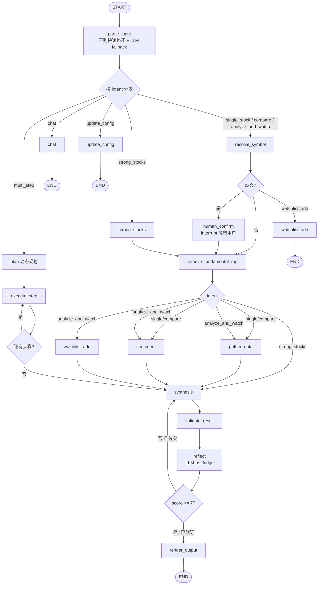

# Atlas LangChain / LangGraph 模块说明

本文描述 `langchain_agent/` 内 **从 HTTP 请求到最终报告** 的完整工作流程，便于开发与对接 OpenClaw 等客户端。

---

## 1. 技术栈与职责

| 组件 | 用途 |
|------|------|
| **LangGraph** | 主编排：17 节点状态机、条件分支、并行 fan-out、会话检查点 |
| **LangChain** | 消息抽象、LLM 工厂、13 个工具（Tools）、回调（用量统计） |
| **预置 ReAct** | `langgraph.prebuilt.create_react_agent`：基本面子 Agent、情绪子 Agent |
| **FastAPI** | 对外 REST + SSE 流式：`/chat`、`/analyze`、`/watchlist` 等 |
| **Next.js** | 前端 UI：聊天、分析、强势股、观察组管理 |
| **Pydantic** | `FundamentalReport` 等结构化输出校验 |
| **Chroma + Embeddings** | 可选：同一会话内「财报 / 深度文档」向量索引，采集与合成前 RAG |
| **SQLite** | 会话持久化（AsyncSqliteSaver）、观察组、市场快照缓存 |
| **yfinance + 快照** | 金融数据主源 + JSON 快照 fallback（限速保底） |

**本模块不负责**：强势股池的**定时构建**（在仓库 `openbb/`）；本模块通过工具调用读取已生成的监控池结果。

---

## 2. 目录结构（与流程相关）

```
langchain_agent/app/
├── main.py                 # FastAPI 入口
├── config.py               # LLM、ATLAS_FORCE_RESPONSE_LOCALE 等
├── api/routes.py           # 路由 → graph.ainvoke
├── dependencies.py         # 单例 compile_graph + 每请求 callbacks
├── agents/
│   ├── graph.py            # StateGraph 定义与条件边
│   ├── nodes.py            # 各节点实现（解析、采集、合成…）
│   ├── fundamental.py      # 基本面 ReAct Agent 工厂
│   ├── sentiment.py        # 情绪 ReAct Agent 工厂
│   └── synthesis.py        # 合成 LLM + JSON 抽取
├── models/state.py         # AgentState（图状态）
├── models/analysis.py      # FundamentalReport 等
├── prompts/                # 各角色 system prompt + response_policy（回答口径）
├── tools/                  # @tool 金融数据工具
├── memory/store.py         # LangGraph checkpointer（MemorySaver）
├── memory/embeddings.py    # OpenAI 兼容 Embeddings（基本面 RAG）
├── memory/vector_store.py  # Chroma：会话内财报/深度文本分块写入与检索
└── callbacks/tracing.py    # CostTracker 等
```

---

## 3. 共享状态 `AgentState`

图在节点之间传递 `AgentState`（`app/models/state.py`），核心字段：

| 字段 | 含义 |
|------|------|
| `messages` | 对话消息（`add_messages` 归约，可追加） |
| `intent` | `single_stock` \| `strong_stocks` \| `compare` \| `chat` |
| `tickers` | 解析出的代码列表 |
| `resolved_symbol` | 解析/校验后的主代码 |
| `financial_data` | 字典：如 `fundamental_text`、`sentiment_text`、`strong_stocks_text` |
| `structured_report` | 合成产出的 `FundamentalReport` 字典（可含 JSON 解析失败时的原始字段） |
| `analysis_result` | 含 `report` 等中间结果 |
| `markdown_report` | **最终面向用户的 Markdown**（由 `render_output` 或降级逻辑写出） |
| `errors` | 各节点累积的告警（如维度缺失、无结构化报告） |
| `session_id` | 会话 ID，用于 checkpoint |
| `retrieved_fundamental_context` | （可选）`retrieve_fundamental_rag` 写入的**已入库财报/深度文档**检索片段，供 `gather_data` 与 `synthesise` 使用 |

**长短期记忆**：**短期**仍为 LangGraph checkpoint（多轮 `messages`）；**会话内语义索引** 在启用 `RAG_FUNDAMENTAL_ENABLED` 且配置 `EMBEDDING_API_KEY` 时，通过 `POST /api/v1/fundamental-documents` 或 `AnalyzeRequest.deep_document_text` 将 **10-K / 年报 / MD&A 等纯文本** 分块写入 Chroma（`metadata.source=fundamental_deep_document`）；在 **`gather_data` 之前**按用户问题 + 标的检索，与工具拉取的**最新数据冲突时以工具为准**（见 `gather_data` 用户消息与 `synthesis` 提示词）。

---

## 4. 总流程图（LangGraph）



### 意图路由（6 种）

- **`single_stock` / `compare`**：resolve → RAG → 并行（gather + sentiment）→ synthesis → validate → reflect → render。
- **`analyze_and_watch`**：resolve → RAG → 并行（gather + sentiment + watchlist_add）→ synthesis → …。
- **`strong_stocks`**：跳过 resolve/gather/sentiment，经 RAG 后直接 synthesis。
- **`multi_step`**：动态规划 → execute_step 循环 → synthesis → …。
- **`update_config`**：筛选参数更新 → END。
- **`chat`**：LLM 闲聊兜底。

条件边逻辑见 `app/agents/graph.py` 中 `_route_by_intent`、`_route_after_resolve`、`_route_after_fundamental_rag`、`_route_after_reflect`、`_route_after_execute_step`。

---

## 5. 按节点说明（单股主路径）

### 5.1 `parse_input`

- 用 **tool-calling LLM** 读用户**最后一条 HumanMessage**。
- 输出 JSON：`intent` + `tickers`（可将「英伟达」等映射为 NVDA）。
- 失败则退化为 `chat` + 空 tickers。

### 5.2 `resolve_symbol`（`single_stock` / `compare`）

- 若 ticker 需解析（非全大写等），再用 LLM 将名称映射为标准代码。
- 用 **yfinance** 对代码做存在性/行情类校验；问题写入 `errors`，尽量保留代码继续跑。

### 5.3 `retrieve_fundamental_rag`

- 当 `RAG_FUNDAMENTAL_ENABLED=true` 且已配置嵌入 API 时：按**最后一条用户消息 + 当前标的**对**同一会话**（`session_id`）内、**来源为已上传深度文档**（`fundamental_deep_document`）的向量做相似度检索，将结果写入 `retrieved_fundamental_context`。
- 关闭或未配置时：返回空字符串，不报错。
- **单股/对比路径**：检索完成后进入 `gather_data`，基本面 Agent 的用户消息中会附带 RAG 片段；**强势股路径**：检索后直接进入 `synthesis`。

### 5.4 `gather_data`

- 构建 **基本面 ReAct Agent**（`create_fundamental_agent`）。
- 系统提示经 `augment_system_prompt` 附加全局「情报边界 / 中文强制」等策略（见 `app/prompts/response_policy.py`）。
- 若 `retrieved_fundamental_context` 非空，会在用户任务后附加 **「Deep filing excerpts」**，供 ReAct 与工具数据交叉验证（数值以工具为准）。
- `ainvoke(..., config={"recursion_limit": FUND_LIMIT})`，将最终 AI 长文写入 `financial_data.fundamental_text`。

**工具集 `FUNDAMENTAL_TOOLS`**（`app/tools/__init__.py`）：财报、关键指标、公司概况、同业、风险指标、催化剂等（**不含**新闻，新闻在下一步）。

### 5.5 `sentiment`

- 构建 **情绪 ReAct Agent**，工具主要为 `get_company_news`。
- 输出写入 `financial_data.sentiment_text`。

### 5.6 `strong_stocks`（仅强势股意图）

- 直接 `invoke` 工具拉取美股/港股强势股列表文本，写入 `financial_data.strong_stocks_text`。
- 不经过基本面/情绪子 Agent。

### 5.6a `plan` + `execute_step`（仅 `multi_step` 意图）

- `plan_node`：LLM 将复杂多步请求拆解为步骤列表，写入 `execution_plan`。
- `execute_step_node`：按顺序执行每一步（可能调用工具或子 Agent），循环直到 `plan_step_index >= len(plan)`。
- 完成后进入 `synthesis`。

### 5.7 `synthesis`

- **若仅有强势股上下文、无基本面长文**：拼接市场概览等，生成 Markdown 简报，`structured_report = None`。
- **否则**：调用 `synthesise()`：
  - 使用 **reasoning LLM** + 动态 `ChatPromptTemplate`（system = `augment_system_prompt(SYNTHESIS_SYSTEM)`）。
  - 将 `retrieved_fundamental_context`（若有）注入提示词，标明**与工具数据冲突时以工具为准**。
  - 模型输出：**叙事 Markdown** +  fenced **`json`** 块。
  - 解析 JSON → `FundamentalReport.model_validate` → `structured_report`；正文去掉 JSON 块后保留为 markdown 叙事部分（最终展示以 `render` 为准时有结构化则覆盖版式）。

### 5.8 `validate_result`

- 对 `structured_report` 做**质量门控**：各维度是否有数值、`intelligence_overview.summary` 与 `highlights` 是否为空、`risk_factors` 是否为空等。
- 不通过时只追加 **字符串告警** 到 `errors`，不中断图。

### 5.9 `reflect`（LLM-as-Judge）

- 使用 reasoning LLM 对 synthesis 输出进行质量评分（1-10）。
- 评分 >= 7 或已修订 >= 1 次 → 接受，进入 render。
- 评分 < 7 且首次 → `revision_count += 1`，附带修订建议回到 synthesis 重做。

### 5.10 `render_output`

- 若存在合规结构化报告：按固定模板生成 **表格化 Markdown**（Factual summary、盈利、增长、估值、财务健康、情绪、亮点、风险、Data Limitations）。
- 若无结构化报告：退回 `analysis_result.report` 并附加 errors 说明。

### 5.11 `chat`

- 单轮 LLM，system 经 `augment_system_prompt`，用于泛聊与引导用户提供 ticker。

---

## 6. API 与图的关系

| 端点 | 行为 |
|------|------|
| `POST /api/v1/fundamental-documents` | 将 `text`（财报/MD&A 等纯文本）按 `session_id` + `ticker` 分块入库，供后续同会话分析 RAG。 |
| `POST /api/v1/chat` | `input_state = { messages: [HumanMessage], session_id }`，`graph.ainvoke`。非流式取最后一条 AI 消息；流式用 `astream_events` 转发 token/tool 事件。 |
| `POST /api/v1/analyze` | 将 body 中 ticker 拼成一句英文分析请求作为 **唯一用户消息**，同样走整张图；可选 **`deep_document_text`** 在当次请求内先入库再跑图；返回 `markdown_report` + `structured_report` + `errors`。 |
| `GET /api/v1/health` | 不跑图，仅配置检查。 |
| `POST /api/v1/strong-stocks` | **不经过 LangGraph**，直接调用工具 `get_strong_stocks` 返回 JSON 列表（与图内 `strong_stocks` 节点数据源一致）。 |
| `GET /api/v1/sessions/{id}` | `graph.aget_state` 拉 checkpoint 中的 `messages`。 |

依赖注入：`dependencies.get_compiled_graph()` 使用 **单例** `compile_graph(checkpointer)`，避免重复编译。

---

## 7. 数据源统计（工具层）

以下为 **`app/tools/`** 实际调用的外部/本地数据来源，便于排查「数据从哪来」、合规与延迟预期。  
**说明**：`app/providers/`（`yfinance` / `openbb` / `mock` 抽象）已实现，但**当前各 `@tool` 多为直接调用 OpenBB SDK 或 yfinance**；统一走 `get_provider()` 尚未接到每一个工具上。

### 7.1 汇总表（13 个工具）

| 工具 | 主要数据路径 | 底层/备注 |
|------|----------------|-----------|
| `get_company_profile` | Provider → OpenBB → yfinance fallback | 快照保底 |
| `get_key_metrics` | Provider → OpenBB → yfinance fallback | 快照保底 |
| `get_financial_statements` | Provider → OpenBB → yfinance fallback | 快照保底 |
| `get_company_news` | Provider → OpenBB → yfinance fallback | 快照保底（新闻不稳定） |
| `get_peer_comparison` | yfinance `Ticker.info` + 内置 `SECTOR_PEERS` / `HK_SECTOR_PEERS` | 静态行业映射（含港股） |
| `get_risk_metrics` | yfinance：`info`（beta）、`history` 算波动率、`insider_transactions` | 快照保底 |
| `get_catalysts` | yfinance `Ticker.calendar` / `Ticker.info` | 快照保底 |
| `get_price_history` | yfinance `Ticker.history(period, interval)` | OHLCV K 线，快照保底 |
| `get_technical_analysis` | yfinance history + monitor/ `TechnicalIndicators` / `VolatilityCalculator` | RSI/MACD/布林带/缩量突破 |
| `get_strong_stocks` | monitor/ `DataLoader` → 快照 fallback | 依赖 `config.monitor_module_root` |
| `get_market_overview` | monitor/ `MarketConditionChecker` + yfinance index → 快照 fallback | 大盘 + 指数快照 |
| `get_watchlist` | SQLite 本地 `watchlist` 表 | 用户观察组 |
| `get_monitoring_alerts` | monitor/ `StockAnalyzer.analyze_monitoring_pool` | 缩量/突破告警扫描 |

### 7.1.1 数据 Provider 抽象层

`app/providers/` 提供统一的 `FinancialDataProvider` 接口，通过 `FINANCIAL_DATA_PROVIDER` 配置切换：

| Provider | 特点 |
|----------|------|
| `yfinance`（默认） | 免费、无需 API Key，有频率限制 |
| `openbb` | OpenBB SDK 封装，底层也走 yfinance |
| `fmp` | Financial Modeling Prep 付费 API，需 `FMP_API_KEY` |
| `mock` | 固定测试数据（AAPL/NVDA/AMD），用于测试 |

### 7.1.2 快照 Fallback 机制

`ticker_cache.py` 在 API 返回空/失败时自动读取 `cache/snapshots/<SYMBOL>_<type>.json`。预热脚本 `scripts/warm_demo.py` 生成快照文件。

### 7.2 图内节点额外数据源

| 节点 | 数据来源 |
|------|----------|
| `resolve_symbol` | **yfinance** `Ticker.info` 校验代码是否可解析 |
| `synthesis` | **无市场数据**：仅 LLM（DeepSeek / 智谱等）根据上游文本生成报告与 JSON |

### 7.3 LLM（非行情数据）

- **路由 / 解析 / 合成 / 闲聊**：`app/llm/factory.py`，通过 `LLM_PROVIDER` 连接 **MiniMax**（默认，`langchain_community.MiniMaxChat`，模型 `MiniMax-M2.7`）、**DeepSeek** 或 **智谱**；仅需在 `.env` 配置对应 API Key。**不产生行情**，仅生成文本与结构化字段。

### 7.4 环境依赖提示

- **OpenBB Python 包**：用于 `company_profile`、`key_metrics`、`financial_statements`、`news` 等工具；需满足项目 `pyproject.toml` 中的 `openbb` 版本。
- **OPENBB_TOKEN**：部分 OpenBB 云端能力可能需要；以 `app/config.py` 与 OpenBB 文档为准。
- **`openbb/`  sibling 目录**：强势股与市况工具依赖 `../openbb` 可导入；部署时需一并同步或调整 `openbb_module_root`。

---

## 8. 会话记忆（Checkpoint）

- `memory/store.py`：`AsyncSqliteSaver` 持久化到 `atlas_sessions.db`（支持多轮对话跨重启恢复）。
- `make_thread_config(session_id)` → `configurable.thread_id`，与 OpenClaw 传入的 `session_id` 对齐即可复现同一会话。

---

## 9. 观测与成本

- 每次请求 `get_fresh_callbacks()`，其中 **CostTracker** 统计 LLM 调用次数、token、延迟，在 `ChatResponse` / `AnalyzeResponse` 的 `usage` 中返回（具体字段见回调实现）。

---

## 10. 与仓库其他部分的关系

- **`monitor/`**：强势股池构建、技术分析模块；`get_strong_stocks` / `get_market_overview` / `get_technical_analysis` / `get_monitoring_alerts` 等工具依赖 `config.monitor_module_root` 注入到 `sys.path` 后 import。
- **`frontend/`**：Next.js 前端，通过 `/api/*` 代理和 `NEXT_PUBLIC_API_DIRECT` 直连后端。
- **OpenClaw**：作为网关调用本服务 HTTP API；**不**在本仓库内实现。

---

## 11. 阅读代码的推荐顺序

1. `app/agents/graph.py` — 总拓扑  
2. `app/agents/nodes.py` — 业务全在节点里  
3. `app/agents/fundamental.py` + `app/agents/sentiment.py` — ReAct 子图  
4. `app/agents/synthesis.py` — 合成与 JSON  
5. `app/api/routes.py` — 入口与 `input_state` 形态  

如需调整「回答口径」或「强制中文」，从 `app/prompts/response_policy.py` 与 `app/config.py` 中的 `atlas_force_response_locale` 入手。
